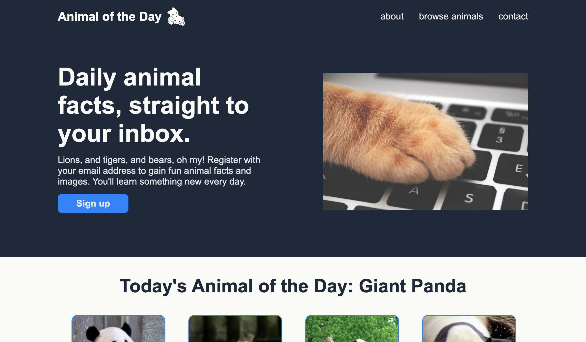

# Animal Landing Page

### Introduction

This project is a sample landing page for an "Animal of the Day" website, built from CSS and HTML.

The project primarily demonstrates basic CSS tools and skills including common elements (e.g., color, font, and size), the box model (e.g., margin, border, and padding), and flexbox (e.g., alignment, centering, growing/shrinking).

### Preview

Run this project [here](https://xsherryhe.github.io/animal-landing-page/).

Image credits:

1) Александар Цветановић: https://www.pexels.com/@lemonzandtea
https://www.pexels.com/photo/orange-cat-foot-on-laptop-keyboard-1440387/

2) Isolate Create: https://www.pexels.com/@isolate-create-2434553
https://www.pexels.com/photo/panda-eating-green-and-brown-leaves-4062907/

3) MarmotWhistler: https://pixabay.com/users/marmotwhistler-10002805/
https://pixabay.com/photos/china-chengdu-panda-baby-panda-3651295/

4) Ddou Dou: https://www.pexels.com/@ddou-dou-2163061
https://www.pexels.com/photo/panda-sitting-on-top-of-a-wood-8162930/

5) Michael Noel: https://www.pexels.com/@michael-noel-3068524
https://www.pexels.com/photo/white-and-black-panda-on-brown-tree-trunk-4741848/

6) OpenClipart-Vectors: https://pixabay.com/users/openclipart-vectors-30363/
https://pixabay.com/vectors/kitty-cuddling-cat-kitten-feline-151949/
